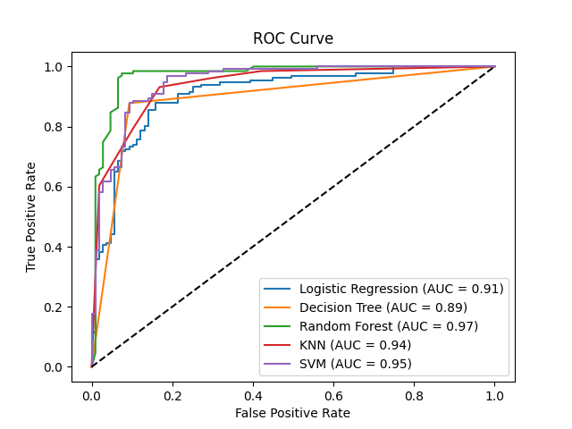
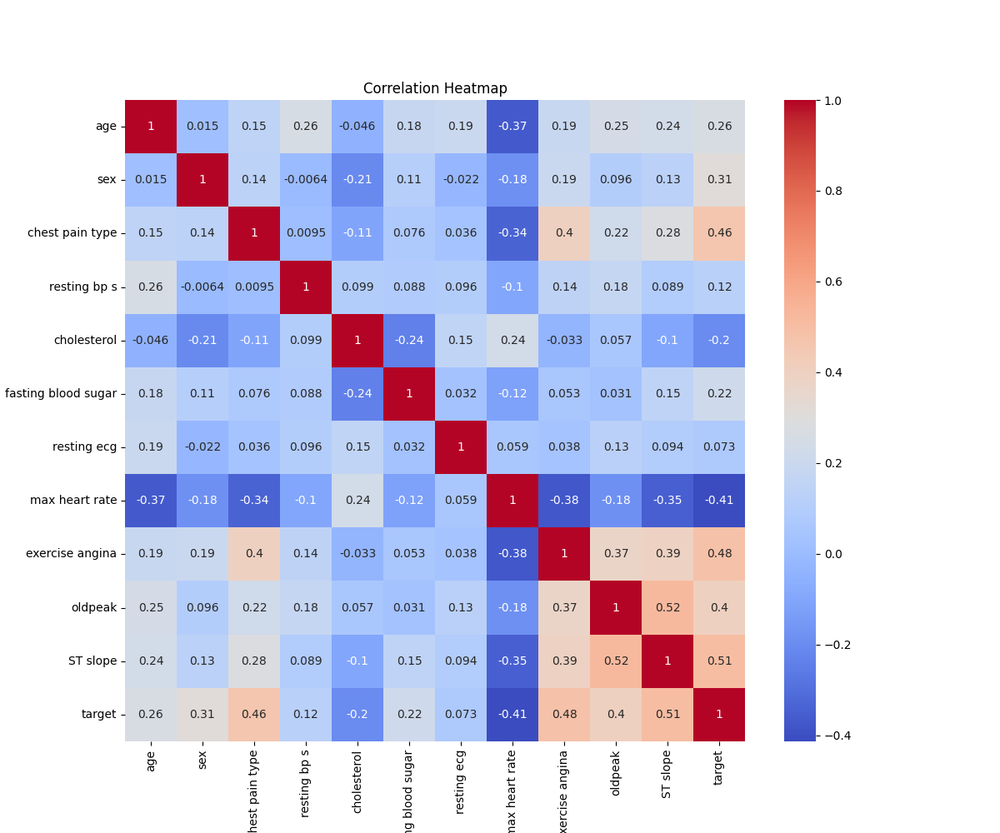
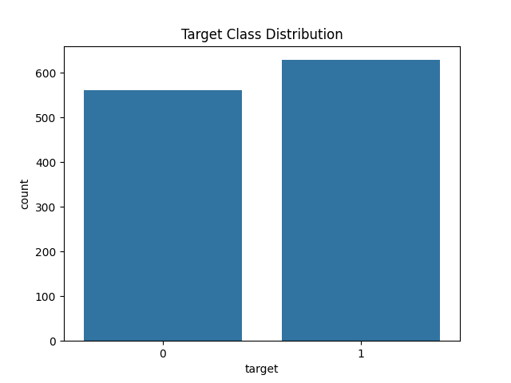

# 🫀 Heart Disease Detection using Machine Learning

This project predicts the presence of heart disease using patient health data and machine learning models. It compares multiple models and saves the best one (Random Forest) for future predictions.

## 📁 Dataset

- `dataset.csv` — contains patient health records
- Features include: age, sex, cholesterol, blood pressure, ECG, etc.
- Target: 0 (no heart disease), 1 (has heart disease)

## 🚀 Features

- Trains Logistic Regression, Decision Tree, Random Forest, KNN, and SVM
- Evaluates performance with accuracy, classification report, ROC-AUC
- Saves best model and scaler for future use
- Predicts heart disease from terminal using live user input
- Doesn't retrain if model already exists (loads from file)
- ROC Curve plotted and saved as `roc_curve.png`

# 🧪 How to Use (Clone and Run)
```bash
# Clone the repo
git clone https://github.com/YOUR_USERNAME/heart_disease_detection.git
cd heart_disease_detection

# (Optional) Create a virtual environment
python -m venv venv
# Activate it
# Windows:
venv\Scripts\activate
# macOS/Linux:
source venv/bin/activate

# Install dependencies
pip install -r requirements.txt

# Run the script
python heart_disease_detection.py

```

3. **Make predictions**  
Enter values in this order:
```
Age, Sex, Chest Pain, Resting BP, Cholesterol, FBS, ECG, Max HR, Exercise Angina, Oldpeak, ST Slope
```

Example:
```
56,1,3,130,250,0,1,160,0,1.5,2
```

Type `exit` to quit the prediction loop.

## 📦 Output Files

- `models/random_forest.pkl` — saved model
- `models/scaler.pkl` — saved scaler
- `roc_curve.png` — ROC curve of all models

## 📌 Notes

- Model is trained only once and reused
- All predictions are interactive through the terminal
- Built using Python and scikit-learn

---

## 📷 Visual Results

### ROC Curve (Model Comparison)


### Correlation Heatmap


### Target Class Distribution


---
